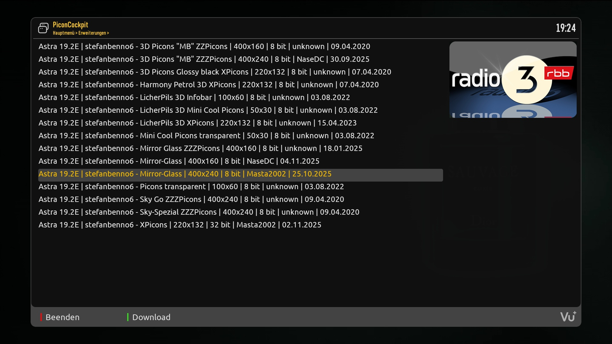
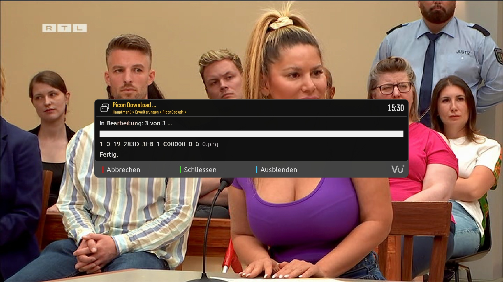

# PiconCockpit (PIC)

## Features
PiconCockpit is a plugin for OA receivers that downloads picons from a picon server.

## Limitations
- PIC is being tested on DM 9xx running OpenVix only
- PIC currently only supports E2-DarkOS skin

## Languages
- english
- german
- italian (by Spaeleus)

## Links
- Installation: https://xcentauri.github.io/PiconCockpit
- Support: https://github.com/xcentaurix/PiconCockpit/discussions
